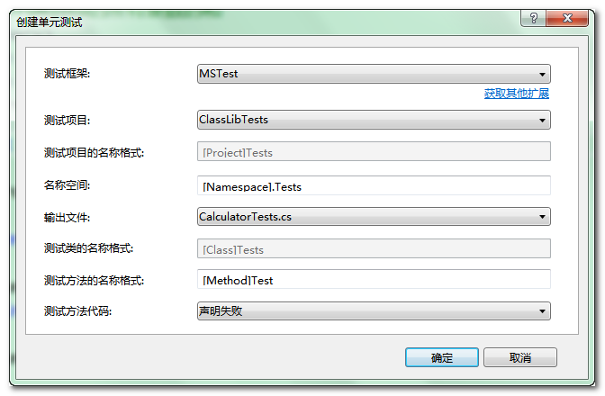
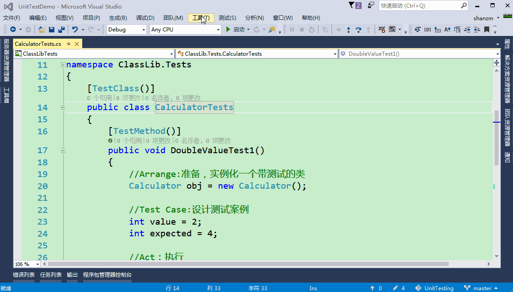

## 使用MSTest框架对 .NET程序单元测试（入门级） {ignore=true}


<!-- @import "[TOC]" {cmd="toc" depthFrom=1 depthTo=6 orderedList=false} -->

<!-- code_chunk_output -->
目录
- [1.单元测试概念](#1单元测试概念)
- [2.单元测试的原则](#2单元测试的原则)
- [3.单元测试实例](#3单元测试实例)
  - [3.1一个简单的手写单元测试实例](#31一个简单的手写单元测试实例)
  - [3.2使用VS中自带的单元测试框架MSTest](#32使用vs中自带的单元测试框架mstest)
  - [3.3单元测试中的断言Assert](#33单元测试中的断言assert)
- [参考](#参考)

<!-- /code_chunk_output -->


### 1.单元测试概念

* 什么是单元测试？

  单元测试（unittest）是一段自动化的代码，用来调用被测试的方法或类，而后验证基于该方法或类的逻辑行为的一些假设。

  简而言之说：单元测试是一段代码（通常一个方法）调用另外一段代码，随后检验一些假设的正确性。
  
  在过程化编程中，一个单元就是单个程序、函数、过程等；
  
  对于面向对象编程，**最小单元就是方法**，包括基类（超类）、抽象类、或者派生类（子类）中的方法。

* 为什么要单元测试？

  单元测试的目标是隔离程序部件并证明这些单个部件是正确的。单元测试在软件开发过程的早期就能发现问题。

  在代码重构或是修改的时候，可以根据单元测试快速验证新修改的代码的正确性，换句话说为了方便系统的后期维护升级！

  单元测试某种程度上**相当于系统的文档**。借助于查看单元测试提供的功能和单元测试中如何使用程序单元，开发人员可以直观的理解程序单元的基础API，即提高了代码的可读性！

  若是开发流程按照**测试驱动开发**则先行编写的单元测试案例就相当于：软件工程瀑布模式中第二阶段——设计阶段的文档
  使用测试驱动开发，可以避免实际开发中编程人员不完全按照文档规范，因为是基于单元测试设计方法，开发人员不遵循设计要求的解决方案永远不会通过测试。

  具体的==测试驱动开发==:todo---------------------------

* 什么时候需要单元测试?

  单元测试通常被认为是编码阶段的附属工作。可以在编码开始之前或源代码生成之后进行单元测试的设计。——《软件工程：实践者的研究方法》

  对于需要长期维护的项目，单元测试可以说是必须的

  通常来说，程序员每修改一次程序就会进行最少一次单元测试，在编写程序的过程中前后很可能要进行多次单元测试，以保证没有程序错误；虽然单元测试不是必须的，但也不坏，这牵涉到项目管理的政策决定。

* 单元测试谁来编写？

  不需要专门的软件测试人员编写测试案例，单元测试通常由软件开发人员编写。

  **也正式因为是开发人员自己写单元测试部分，也可以让开发者仔细的思考自己方法和接口是否可以更加便于调用**

* 单元测试局限性

  不能发现集成错误、性能问题、或者其他系统级别的问题。单元测试结合其他软件测试活动更为有效。

* 单元测试框架
  
  通常在没有特定框架支持下，自行创建一个项目作为单元测试项目完全是可行的。
  使用单元测试框架，同时配合编辑器VS，编写单元测试相对来说会简单许多。
  .NET下的单元测试框架：MSTest、NUnit
                   


### 2.单元测试的原则

根本原则：

* Automatic(自动化)
  单元测试应该是全自动执行的，并且非交互式的
* Independent
  单元测试方法的执行顺序无关紧要
  单元测试的各个方法之间不应该相互依赖
* Repeatable
  功能代码不改的前提下，相同的测试代码多次运行，应该得到相同的结果
* Self-validating
  单元测试方法只有两个可能的运行结果：通过或失败，没有第三种情况。

其他一些规范：

* 最理想的情况下，应该尽量多写测试用例，以保证代码功能的正确性符合预期，具有良好的容错性。如果代码较复杂，条件分支较多，测试用例最好能覆盖所有的分支路径。

* 实际开发中，没有必要对每一个函数都进行单元测试。但是若是一个比较独立的功能（当然也可能这个功能就一个函数），应该对这个功能进行比较详尽的测试。

* 单元测试的基本目标:语句覆盖率达到 70%;核心模块的语句覆盖率和分支覆盖率都要达到 100%。

* 注意一个类中可能有许多方法，我们不是要把所有的方法的单元测试都写完，在去实现代码，而是写完一个单元测试，就去实现一个方法，是一种快速的迭代

* 不测试私有方法，因为私有方法不被外部调用，测试意义不大，而且你非要测试，那就要使用反射，比较麻烦。

* 一个测试只测试一个功能

### 3.单元测试实例

#### 3.1一个简单的手写单元测试实例

为了简洁明了的说明什么是单元测试，首先不使用单元测试框架，自行编写单元测试项目

比如说新建了一个类Calculator用于对数据的计算，

如下只是随便的的写了个方法，方便理解：

```cs
 public class Calculator
    {
        //求一个数的二倍
        public int DoubleValue(int i)
        {
            return i * 2;
        }
    }
```

新建了Calculator类之后，我们编写单元测试代码对该类中方法进行单元测试：
首先新建一个项目，对待测试的方法所在的项目添加引用,

编写代码，测试ClassLib项目中Calculator类中的DoubleValue()方法

测试DoubleValue(int value),该函数是求一个数的二倍，给其一个参数value=2,则期望其得到的结果是4，若是其他值则说明函数编写是错误的，测试不通过。若是该函数的运行结果和期望的结果一样则运行通过


```cs
public static void CalculatorDoubleValueTest()
   {  
        //生成一个测试对象的实例
        Calculator obj = new Calculator();
        //设计测试案例
        int value = 2;
        int expected = 4;
            
        //与预期比较
        if (expected == obj.DoubleValue(value))
        {
            Console.WriteLine("测试通过");
        }
        else
        {
            Console.WriteLine($"测试未通过,测试的实际结果是{obj.DoubleValue(value)}");
        }
        Console.ReadKey();
    }
```
通过上面的示例，简单的演示了单元测试是什么，但是实际中一般都是使用已有的单元测试框架。而且测试一个方法为了完备性一般都要到所有的逻辑路径进行测试，所以会对一个方法写多个测试方法。

#### 3.2使用VS中自带的单元测试框架MSTest

继续测试上述的Calculator类中的DoubleValue()

新建项目--->选择测试类项目中的单元测试项目，命名为"被测试项目名+Tests"

测试类的命名为“被测试的类+Tests”

测试函数的命名按照被"**[被测方法]_ [测试场景]_[预期行为]**"格式命名
  * 方法名——被测试的方法
  * 测试场景——能产生预期行为的条件
  * 预期行为——在给定条件下，期望被测试方法产生什么结果

当然在VS中也可以在想要测试的函数上右键，创建单元测试，弹出如下窗口，直接点击确定即可,即可生成默认的单元测试代码模版。

但是《.NET单元测试艺术》中对测试函数的命名格式推荐为：




这里先使用默认自带的MSTest框架，使用默认的命名格式，会自动生成相应的测试项目和测试函数格式。

编写单元测试的代码，一般按照以下四步编写:
**Arrange:配置测试对象**
**TestCase:准备测试案例**
**Act:操作测试对象**
**Assert:对操作断言**


```cs
//注意 [TestClass]和[TestClass()]，[TestMethod()]和[TestMethod]写法等价
namespace ClassLib.Tests
{
    [TestClass()]//通过标注该特性标签表明该类为测试类
    public class CalculatorTests
    {
        [TestMethod()]//通过标注该特性标签表明该函数为测试函数
        public void DoubleValueTest_DoubleValue_ReturnTrue()
        {
            //Arrange:准备，实例化一个带测试的类
            Calculator obj = new Calculator();

            //Test Case:设计测试案例
            int value = 2;
            int expected = 4;

            //Act：执行
            int actual = obj.DoubleValue(value);

            //Assert：断言
            Assert.AreEqual(expected, actual);
        }
    }
}
```
点击测试-->运行-->所有测试
或点击测试-->窗口-->测试资源管理器-->运行所有测试



上面运行显示测试通过显示的是绿色的标志，若是测试不通过则会则显示红色标志，在单元测试中有一种“红绿灯”的概念（你是使用其他的单元测试框架也是同样的红绿标志）。

在测试驱动开发的流程中，就是“红灯-->修改-->绿灯-->重构-->绿灯”的开发流程。

注意：我是使用的不是VS Enterprise版本故无法直接查看代码的测试覆盖率，可以使用插件OpenCover或NCover等其他工具查看单元测试的覆盖率。

上面只是演示了怎么进行一次单元测试，但是实际中我们的测试案例不能仅仅一个，所以要添加多个测试，以提高到测试的完备性

若是对需要大量测试案例的，可以把测试数据存放在专门的用于测试使用的数据库中，在测试时通过连接数据库，使用数据库中的数据进行测试

依旧是上面的示例，把大量的测试案例存放在数据库

```sql
Id                   Input       Expected
-------------------- ----------- -----------
1                    2           4
2                    6           12
3                    13          26
4                    0           0
5                    -2          -4
```

单元测试的代码如下

```cs
 public TestContext TestContext { get; set; }//注意为了获取数据库的数据，我们要自定义一个TestContext属性
[TestMethod()]
[DataSource("System.Data.SqlClient",
            @"server=.;database=db_Tome1;uid=sa;pwd=shanzm",//数据库连接字符串
            "szmUnitTestDemo",//测试数据存放的表
            DataAccessMethod.Sequential)]//对表中的数据测试的顺序，可以是顺序的，也可以是随机的，这里是我们选择顺序
public void DoubleValueTest_DoubleValue_ReturnTrue()
{
    //Arrange
    Calculator target = neCalculator();
    //TestCase
    int value = Convert.ToInt(TestContext.DataR["Input"]);
    int expected Convert.ToInt(TestContext.DataR["Expected"]);
    //Act
    int actual target.DoubleValu(value);
    //Assert
    Assert.AreEqual(expected, actual);
}
```
说明：
1. 特性标签[TestClass] [TestMethod]

   MSTest框架通过标签识别并加载测试

   [TestClass]用来标识包含一个MSTest自动好测试的类，

   [TestMethod]用来标识需要被调用的自动化测试的方法

2. 特性标签[DataSource]标识用来测试的数据源，其的参数如下：

   * 第一个参数是providername，即使用的数据源的命名空间，其实我们也是可是使用Excel表格的（菜单“项目”-->添加新的数据源……）参考：[CSDN:vs2015数据驱动的单元测试](https://blog.csdn.net/site008/article/details/77070945)

     providername值参考：

     * "system.data.sqlclient" ----说明使用的是mssqlserver数据库

     * "system.data.sqllite" ----说明使用的是sqllite数据库

     * "system.data.oracleclient" ----说明使用的是oracle数据库或

     * "mysql.data.mysqlclient" ----说明使用的是mysql数据库

    * 第二个参数是connectionString，我习惯是这样写：

      `@"server=.;database=数据库;uid=用户ID;pwd=密码"`

      但是推荐这样写：
    
      `@"Data Source=localhost;Initial Catalog=数据库;User ID=用户ID;Password=密码"`

   * 3.第三个参数是tablename,选择使用的数据库中的哪张表

   * 4.对表中的数据测试的顺序.
   可以是顺序的：`DataAccessMethod.Sequential`，
   可以是随机的:`DataAccessMethod.Random`。

#### 3.3单元测试中的断言Assert

1. `Assert.AreEqual(expectedObject,actualObject,message);`

2. `Assert.Fail();`

### 参考

[书籍：.NET 单元测试的艺术]()
[书籍：单元测试之道C#版](https://pan.baidu.com/s/11VuVW)
[微软：dotnet文档](https://docs.microsoft.com/zh-cn/dotnet/core/testing/unit-testing-with-mstest)