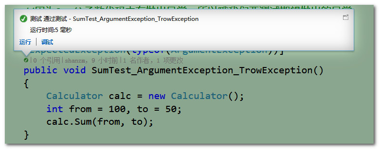

## 关于C#程序的单元测试 {ignore=true}


<!-- @import "[TOC]" {cmd="toc" depthFrom=1 depthTo=6 orderedList=false} -->

<!-- code_chunk_output -->
目录
- [1.单元测试概念](#1单元测试概念)
- [2.单元测试的原则](#2单元测试的原则)
- [3.单元测试简单示例](#3单元测试简单示例)
  - [3.1一个简单的手写单元测试实例](#31一个简单的手写单元测试实例)
  - [3.2单元测试框架MSTest](#32单元测试框架mstest)
- [4.单元测试框架特性标签](#4单元测试框架特性标签)
- [5.单元测试中的断言Assert](#5单元测试中的断言assert)
- [6.单元测试中验证预期的异常](#6单元测试中验证预期的异常)
- [7.单元测试中针对状态的间接测试](#7单元测试中针对状态的间接测试)
- [8.单元测试在MVC模式中的实现](#8单元测试在mvc模式中的实现)
- [8.单元测试相关参考](#8单元测试相关参考)
- [9.示例源代码下载](#9示例源代码下载)

<!-- /code_chunk_output -->


### 1.单元测试概念

* 什么是单元测试？

  单元测试（unittest）是一段自动化的代码，用来调用被测试的方法或类，而后验证基于该方法或类的逻辑行为的一些假设。

  简而言之说：单元测试是一段代码（通常一个方法）调用另外一段代码，随后检验一些假设的正确性。
  
  在过程化编程中，一个单元就是单个程序、函数、过程等；
  
  对于面向对象编程，**最小单元就是方法**，包括基类（超类）、抽象类、或者派生类（子类）中的方法。

* 为什么要单元测试？

  单元测试的目标是隔离程序部件并证明这些单个部件是正确的。单元测试在软件开发过程的早期就能发现问题。

  在代码重构或是修改的时候，可以根据单元测试快速验证新修改的代码的正确性，换句话说为了方便系统的后期维护升级！

  单元测试某种程度上**相当于系统的文档**。借助于查看单元测试提供的功能和单元测试中如何使用程序单元，开发人员可以直观的理解程序单元的基础API，即提高了代码的可读性！

  若是开发流程按照**测试驱动开发**则先行编写的单元测试案例就相当于：软件工程瀑布模式中第二阶段——设计阶段的文档
  使用测试驱动开发，可以避免实际开发中编程人员不完全按照文档规范，因为是基于单元测试设计方法，开发人员不遵循设计要求的解决方案永远不会通过测试。

  具体的==测试驱动开发==:todo---------------------------

* 什么时候需要单元测试?

  “单元测试通常被认为是编码阶段的附属工作。可以在编码开始之前或源代码生成之后进行单元测试的设计。”——《软件工程：实践者的研究方法》

  对于需要长期维护的项目，单元测试可以说是必须的

  通常来说，程序员每修改一次程序就会进行最少一次单元测试，在编写程序的过程中前后很可能要进行多次单元测试，以保证没有程序错误；虽然单元测试不是必须的，但也不坏，这牵涉到项目管理的政策决定。

* 单元测试谁来编写？

  不需要专门的软件测试人员编写测试案例，单元测试通常由软件开发人员编写。

  **也正式因为是开发人员自己写单元测试部分，也可以让开发者仔细的思考自己方法和接口是否可以更加便于调用**

* 单元测试局限性

  不能发现集成错误、性能问题、或者其他系统级别的问题。单元测试结合其他软件测试活动更为有效。

* 单元测试框架
  
  通常在没有特定框架支持下，自行创建一个项目作为单元测试项目完全是可行的。
  使用单元测试框架，同时配合编辑器VS，编写单元测试相对来说会简单许多。
  .NET下的单元测试框架：MSTest、NUnit
                   


### 2.单元测试的原则

根本原则：

* Automatic(自动化)
  单元测试应该是全自动执行的，并且非交互式的
* Independent
  单元测试方法的执行顺序无关紧要
  单元测试的各个方法之间不应该相互依赖
* Repeatable
  功能代码不改的前提下，相同的测试代码多次运行，应该得到相同的结果
* Self-validating
  单元测试方法只有两个可能的运行结果：通过或失败，没有第三种情况。

其他一些规范：

* 最理想的情况下，应该尽量多写测试用例，以保证代码功能的正确性符合预期，具有良好的容错性。如果代码较复杂，条件分支较多，测试用例最好能覆盖所有的分支路径。

* 实际开发中，没有必要对每一个函数都进行单元测试。但是若是一个比较独立的功能（当然也可能这个功能就一个函数），应该对这个功能进行比较详尽的测试。

* 单元测试的基本目标:语句覆盖率达到 70%;核心模块的语句覆盖率和分支覆盖率都要达到 100%。

* 注意一个类中可能有许多方法，我们不是要把所有的方法的单元测试都写完，在去实现代码，而是写完一个单元测试，就去实现一个方法，是一种快速的迭代

* 不测试私有方法，因为私有方法不被外部调用，测试意义不大，而且你非要测试，那就要使用反射，比较麻烦。

* 一个测试只测试一个功能

### 3.单元测试简单示例

#### 3.1一个简单的手写单元测试实例

为了简洁明了的说明什么是单元测试，首先不使用单元测试框架，自行编写单元测试项目

比如说新建了一个类Calculator用于对数据的计算，

如下只是随便的的写了个方法，方便理解：

```cs
public class Calculator
{
    //求一个数的二倍
    public int DoubleValue(int i)
    {
        return i * 2;
    }
}
```

新建了Calculator类之后，我们编写单元测试代码对该类中方法进行单元测试：
首先新建一个项目，对待测试的方法所在的项目添加引用,

编写代码，测试ClassLib项目中Calculator类中的DoubleValue()方法

测试DoubleValue(int value),该函数是求一个数的二倍，给其一个参数value=2,则期望其得到的结果是4，若是其他值则说明函数编写是错误的，测试不通过。若是该函数的运行结果和期望的结果一样则运行通过


```cs
public static void CalculatorDoubleValueTest()
{  
    //生成一个测试对象的实例
    Calculator obj = new Calculator();
    //设计测试案例
    int value = 2;
    int expected = 4;
        
    //与预期比较
    if (expected == obj.DoubleValue(value))
    {
        Console.WriteLine("测试通过");
    }
    else
    {
        Console.WriteLine($"测试未通过,测试的实际结果是{obj.DoubleValue(value)}");
    }
    Console.ReadKey();
}
```
通过上面的示例，简单的演示了单元测试是什么，但是实际中一般都是使用已有的单元测试框架。而且测试一个方法为了完备性一般都要到所有的逻辑路径进行测试，所以会对一个方法写多个测试方法。

#### 3.2单元测试框架MSTest

单元测试一般都是使用现成的单元测试框架，关于.net的单元测试框架有许多，常见的有NUnit,MSTest等等。

这里使用VS自带的MStest框架做简单的演示（一般推荐使用NUnit框架：Undone）

演示的案例，继续对上述的Calculator类中的DoubleValue()进行单元测试

**注意：通常的做法是为每个被测项目建立一个测试项目，为每个被测类建立一个测试类，并且为每个被测方法至少建立一个测试方法。**

新建项目--->选择测试类项目中的单元测试项目，命名为"被测试项目名+Tests"

测试类的命名为“被测试的类+Tests”

测试函数的命名按照 ：**[被测方法]_ [测试场景]_[预期行为]** 格式命名
  * 方法名——被测试的方法
  * 测试场景——能产生预期行为的条件
  * 预期行为——在给定条件下，期望被测试方法产生什么结果

当然在VS中也可以在想要测试的函数上右键，创建单元测试，弹出如下窗口，直接点击确定即可,即可生成默认的单元测试代码模版


这里先使用默认自带的MSTest框架，使用默认的命名格式，会自动生成相应的测试项目和测试函数格式。

编写单元测试的代码，一般按照以下四步编写:

**Arrange:配置测试对象**

**TestCase:准备测试案例**

**Act:操作测试对象**

**Assert:对操作断言**


```cs
//注意 [TestClass]和[TestClass()]，[TestMethod()]和[TestMethod]写法等价
namespace ClassLib.Tests
{
    [TestClass()]//通过标注该特性标签表明该类为测试类
    public class CalculatorTests
    {
        [TestMethod()]//通过标注该特性标签表明该函数为测试函数
        public void DoubleValueTest_DoubleValue_ReturnTrue()
        {
            //Arrange:准备，实例化一个带测试的类
            Calculator obj = new Calculator();

            //Test Case:设计测试案例
            int value = 2;
            int expected = 4;

            //Act：执行
            int actual = obj.DoubleValue(value);

            //Assert：断言
            Assert.AreEqual(expected, actual);
        }
    }
}
```
点击测试-->运行-->所有测试
或点击测试-->窗口-->测试资源管理器-->运行所有测试


上面运行显示测试通过显示的是绿色的标志，若是测试不通过则会则显示红色标志，在单元测试中有一种“红绿灯”的概念（你是使用其他的单元测试框架也是同样的红绿标志）。

在测试驱动开发的流程中，就是“红灯-->修改-->绿灯-->重构-->绿灯”的开发流程。

注意：我是使用的不是VS Enterprise版本故无法直接查看代码的测试覆盖率，可以使用插件OpenCover或NCover等其他工具查看单元测试的覆盖率。

上面只是演示了怎么进行一次单元测试，但是实际中我们的测试案例不能仅仅一个，所以要添加多个测试，以提高到测试的完备性

若是对需要大量测试案例的，可以把测试数据存放在专门的用于测试使用的数据库中，在测试时通过连接数据库，使用数据库中的数据进行测试

依旧是上面的示例，把大量的测试案例存放在数据库

```sql
Id                   Input       Expected
-------------------- ----------- -----------
1                    2           4
2                    6           12
3                    13          26
4                    0           0
5                    -2          -4
```

单元测试的代码如下

```cs
 public TestContext TestContext { get; set; }//注意为了获取数据库的数据，我们要自定义一个TestContext属性
[TestMethod()]
[DataSource("System.Data.SqlClient",
            @"server=.;database=db_Tome1;uid=sa;pwd=shanzhiming",//数据库连接字符串
            "tb_szmUnitTestDemo",//测试数据存放的表
            DataAccessMethod.Sequential)]//对表中的数据测试的顺序，可以是顺序的，也可以是随机的，这里是我们选择顺序
public void DoubleValueTest_DoubleValue_ReturnTrue()
{
    //Arrange
    Calculator target = neCalculator();
    //TestCase
    int value = Convert.ToInt(TestContext.DataR["Input"]);
    int expected Convert.ToInt(TestContext.DataR["Expected"]);
    //Act
    int actual target.DoubleValu(value);
    //Assert
    Assert.AreEqual(expected, actual);
}
```
说明：
1. 特性标签`[TestClass]` `[TestMethod]`

   MSTest框架通过标签识别并加载测试

   `[TestClass]`用来标识包含一个MSTest自动好测试的类，

   `[TestMethod]`用来标识需要被调用的自动化测试的方法

2. 特性标签`[DataSource]`标识用来测试的数据源，其的参数如下：

   * 第一个参数是providername，即使用的数据源的命名空间，其实我们也是可是使用Excel表格的（菜单“项目”-->添加新的数据源……）参考：[CSDN:vs2015数据驱动的单元测试](https://blog.csdn.net/site008/article/details/77070945)

     providername值参考：

     * `"system.data.sqlclient"` ----说明使用的是mssqlserver数据库

     * `"system.data.sqllite"`   ----说明使用的是sqllite数据库

     * `"system.data.oracleclient"` ----说明使用的是oracle数据库或

     * `"mysql.data.mysqlclient"` ----说明使用的是mysql数据库

    * 第二个参数是connectionString，我习惯是这样写：

      `@"server=.;database=数据库;uid=用户ID;pwd=密码"`

      但是推荐这样写：
    
      `@"Data Source=localhost;Initial Catalog=数据库;User ID=用户ID;Password=密码"`

   * 第三个参数是tablename,选择使用的数据库中的哪张表

   * 第四个参数确定对表中的数据测试的顺序.
   可以是顺序的：`DataAccessMethod.Sequential`，
   可以是随机的:`DataAccessMethod.Random`

### 4.单元测试框架特性标签

 在MSTest单元测试框架中主要有以下的一些特性标签：

([参考](https://www.cnblogs.com/ColdJokeLife/p/3158812.html))

| **MS Test Attribute**  | **用途**                                                     |
| ---------------------- | ------------------------------------------- |
| [TestClass]            | 定义一个测试类，里面可以包含很多测试函数和初始化、销毁函数（以下所有标签和其他断言）。 |
| [TestMethod]           | 定义一个独立的测试函数。                                     |
| [ClassInitialize]      | 定义一个测试类初始化函数，每当运行测试类中的一个或多个测试函数时，这个函数将会在测试函数被调用前被调用一次（在第一个测试函数运行前会被调用）。 |
| [ClassCleanup]         | 定义一个测试类销毁函数，每当测试类中的选中的测试函数全部运行结束后运行（在最后一个测试函数运行结束后运行）。 |
| [TestInitialize]       | 定义测试函数初始化函数，每个测试函数运行前都会被调用一次。   |
| [TestCleanup]          | 定义测试函数销毁函数，每个测试函数执行完后都会被调用一次。   |
| [AssemblyInitialize]   | 定义测试Assembly初始化函数，每当这个Assembly中的有测试函数被运行前，会被调用一次（在Assembly中第一个测试函数运行前会被调用）。 |
| [AssemblyCleanup]      | 定义测试Assembly销毁函数，当Assembly中所有测试函数运行结束后，运行一次。（在Assembly中所有测试函数运行结束后被调用） |
| [Ignore] | 跳过（忽略）该测试函数                                               |
| [TestCategory("测试类别")] | 给测试自定义分类，便于有选择的运行指定类别的单元测试                                               |


说明：

* 使用`[ClassInitialize]`和`[ClassCleanup]`标签特性

   可以在测试之前或之后方便地控制测试的初始化和清理，从而确保所有的测试都是使用新的未更改的状态。
   
   注意，这是很有必要的，可以有效的防止测试失败是因为测试之间的依赖性导致失败。

   注意两个标签特性需要放在一个无返回值的静态方法上,
   
   且标注`[ClassInitialize]`特性的方法的参数是：`TestContext testcontext`

   示例：比如说在一个测试类初始化一个测试对象，并在测试完成后释放，代码如下：

```cs

[TestClass()]
public class CalculatorTests
{
    //使用ClassInitialize标签初始化一个Calculator对象以供下面所有的测试([ClassCleanup]之前）使用
    private static Calculator calc = null;
    [ClassInitialize]
    public static  void  ClassInit(TestContext testcontext)
    {
        calc = new Calculator();
    }

    [TestMethod()]
    public void testMethod1()
    {
         //测试
    }
    [TestMethod()]
    public void testMethod2()
    {
        //测试
    }
    [TestMethod()]
    public void testMethod3()
    {
        //测试
    }
     
    [ClassCleanup]
    public static  void Classup()
    {
        calc = null;
    }
}

```


### 5.单元测试中的断言Assert

1. 断言是什么？可以从字面理解是“十分肯定的说”，在编程中可以通过 不同的断言来测试方法实际运行的结果和你期望的结果是否一致。

2. 断言是单元测试最基本的组成部分，Assert类的静态方法提供了不同形式的多种断言。
   MStest中Assert的常用静态方法：([参考](https://www.cnblogs.com/ColdJokeLife/p/3158812.html))：

   | **MS Test Assert**  | **用途**           |
   | ------------------- | ------------------ |
   | Assert.AreEqual()            | 验证值相等            |
   | Assert.AreNotEqual()         | 验证值不相等          |
   | Assert.AreSame()             | 验证引用相等          |
   | Assert.AreNotSame()          | 验证引用不相等        |
   | Assert.Inconclusive()        | 暗示条件还未被验证    |
   | Assert.IsTrue()              | 验证条件为真          |
   | Assert.IsFalse()             | 验证条件为假          |
   | Assert.IsInstanceOfType()    | 验证实例匹配类型      |
   | Assert.IsNotInstanceOfType() | 验证实例不匹配类型    |
   | Assert.IsNotNull()           | 验证条件为NULL        |
   | Assert.IsNull()              | 验证条件不为 NULL     |
   | Assert.Fail()                | 验证失败              |

4. 针对字符串的断言，使用StringAssert的静态方法：

   注意可以根据VS的只能提示自行查看`StringAssert`的所有静态方法，或是查看`StringAssert`的定义，可以查看其所有的静态方法

   [详细使用可参考](https://www.cnblogs.com/tylerzhou/p/11300896.html)

   | **StringAssert**  | **用途**           |
   | ------------------- | ------------------ |
   | StringAssert.AreEqualIgnoringCase(string   expected,string actual)                | 用于断言  两个字符串在不区分大小写情况下是否相等,需要提供两个参 数,第一个是期待的结果,第二个是实际结果.          |
   | StringAssert.Contains()        | 用于断言一个字符串是否包含另一字符串,其中第一个参数为被包含的字符串,第二个为实际字符串           |
   | StringAssert.StartsWith()      | 断言字符串是否以某(几)字符开始, 第一个参数为开头的字符串 ,第二个为实际字符串         |
   |StringAssert.EndsWith()           |断言字符串是否以某(几)字符结束|
   |StringAssert.Matches()            |断言字符串是否符合特定的正则表达式|  


5. 针对集合的断言，使用CollectionAssert的静态方法：

   注意可以根据VS的只能提示自行查看`CollectionAssert`所有的静态方法，或是查看`CollectionAssert`的定义，可以查看其所有的静态方法

   [详细使用可参考](https://www.cnblogs.com/tylerzhou/p/11300896.html)

   | **CollectiongAssert**  | **用途**           |
   | ------------------- | ------------------ |
   |CollectionAssert.AllItemsAreNotNull |断言集合里的元素全部不是Null,也即集合不包含null元素,这个方法只有一个参数,传入我们要判断的集合即可 |
   |CollectionAssert.AllItemsAreUnique |断言集合里面的元素全部是惟一的,即集合里没有重复元素. |
   |CollectionAssert.AreEqual |用于断言两个集合是否相等 |
   |CollectionAssert.AreEquivalent |用来判断两个集合的元素是否等价,如果两个集合元素类型相同,个数也相同,即视为等价,与上面的AreEqual方法相比,它不关心顺序 |
   |CollectionAssert.Contains|断言集合是否包含某一元素|
   |CollectionAssert.IsEmpty|断言某一集合是空集合,即元素个数为0|
   |CollectionAssert.IsSubsetOf|判断一个集合是否为另一个集合的子集,这两个集合不必是同一类集合(可以一个是array,一个是list),只要一个集合的元素完全包含在另一个集合中,即认为它是另一个集合的子集|


### 6.单元测试中验证预期的异常

若是程序中在某种特定的条件下有异常抛出，为了进行单元测试，我们设计指定的测试案例，期望在该测试案例程序抛出异常，并检验其是否抛出异常。

简单示例：

```cs
/// <summary>
/// 计算从from到to的所有整数的和
/// </summary>
public int Sum(int from, int to)
{
    if (from > to)
    {
        throw new ArgumentException("参数from必须小于to");
    }
    int sum = 0;
    for (int i = from; i <= to; i++)
    {
        sum += i;
    }
    return sum;
}
```

在程序中，若是参数`from` &gt;`to`则抛出异常`new ArgumentException("参数from必须小于to");`

为了检验该程序在该条件下是否真的会抛出异常，可以创造测试案例from=100 &gt; to=50
期望Sum()函数代码中执行：`throw new ArgumentException("参数from必须小于to");`，所以我们要测试期望抛出的异常`ArgumentException`。

使用标签`[ExpectedException(typeof(“抛出的异常对象”))]`

单元测试代码：
```cs
       
//异常测试，添加ExpectedException
[TestMethod]
[ExpectedException(type(ArgumentException))]
public void SumTest_ArgumentException_TrowException()
{
    Calculator bjCalcultor = new Calculator();
    int from=100,to=50；
    calc.Sum(from, to);
}
```

因为程序抛出了我们期望的异常，所以该测试通过。如若程序没有抛出该异常则测试失败。



### 7.单元测试中针对状态的间接测试

* **基于状态的测试（也称状态验证），是指在方法执行之后，通过检查被测系统及其协作者（依赖项）的状态来检测该方法是否正确工作**。

* 简单示例：

  下面的方法`isLastFilenameValid(string filename)`在运行后会改变类中属性`wasLastFileNameValid`的值

 ```cs
//用于存储状态的结果用于以后的验证
public bool wasLastFileNameValid { get; set; }
//判断输入的字符串是否是.txt文件名
public bool isLastFilenameValid(string filename)
{
    if (!(filename .ToLower()).EndsWith("txt"))
    {
        wasLastFileNameValid = false;
        return false ;
    }
    else
    {
        wasLastFileNameValid = true;
        return true;
    }
} 
```

* 单元测试函数：

  该测试是测试isLastFilenameValid()，
  
  因为该函数是把结果赋值给类中属性wasLastFileNameValid，
  
  所以此处验证的是Calculator类中属性wasLastFileNameValid是否符合我们的期望，
  
  而不是简单的验证isLastFilenameValid(）的返回值是否符合我们的期望。

```cs
[TestMethod()]
public void isLastFilenameValid_ValidName_ReturnTrue()
{
    Calculator calc = new Calculator();
    string fileName = "test.txt";
    calc.isLastFilenameValid(fileName)
    Assert.IsTrue(calc.wasLastFileNameValid);
  
}

```

### 8.单元测试在MVC模式中的实现

[参考](https://www.cnblogs.com/tylerzhou/p/11361598.html)
* 因为MVC模式中的Controller类中的Action的返回值是和普通类的方法不一样的，

  Action的返回值是ActionResult类型的，其子类又有许多，

  具体怎么实现对MVC模式的单元测试呢？请看一个简单的示例：

  代码背景：在一个MVC项目中的HomeController控制器中有一个Action是Index()
 
  首先先定义一个Person类其中有Id和Name两个属性

  Action如下：

  ```cs
    public class HomeController : Controller
    {
        // GET: Home
        public ActionResult Index()
        {
            return View("Index",new Person { Id = 001, Name = "shanzm" });
        }
    }

  ```
  对上面的HomeController中的Index()进行一个简单的单元测试

  新建一个单元测试项目（或者在创建MVC项目的时候选中单元测试的按钮，则自动生成一个单元测试项目）

  注意一定要先安装MVC的程序集，NuGet:`Install-Package Microsoft.AspNet.Mvc -Version 5.2.3`

  

  ```cs
    [TestMethod()]
    public void Index_Index_ReturnTrue()
    {
        //Arrage:准备测试对象
        HomeController hcont = new HomeController();
        //Act:执行测试函数
        ViewResult  result =(ViewResult)hcont.Index();
        var viewName = result.ViewName;
        Person model = (Person)result.Model;
        //Assert:断言符合期望
        Assert.IsTrue(viewName == "Index" && model.Id == 001 && model.Name == "shanzm"&& );
    }
  ```

说明：

1. 如果View()函数没指定视图，而是使用默认的视图，则视图名为空，所以如果名称不写的时候我们可以断言ViewName是空。

2. 注意在Action中的ViewBag传递的数据在单元测试中需要通过ViewData方式获取（因为ViewBag是对ViewData的动态封装，在同一个Action中二者数据相通，此乃ASP.NET MVC的基础，不详述）

2. 其实呀，MVC模式作为UI层，有许多东西其实是很难（但不是不可以）模拟对象去进行单元测试的，一般其实不推荐做过多的单元测试。（注意不是不做，是不做过多过复杂的单元测试）

### 8.单元测试相关参考

[书籍：.NET 单元测试的艺术](https://book.douban.com/subject/25934516/)

[书籍：单元测试之道C#版](https://pan.baidu.com/s/11VuVW)

[微软：dotnet文档](https://docs.microsoft.com/zh-cn/dotnet/core/testing/unit-testing-with-mstest)

[博客园：对比MS Test与NUnit Test框架](https://www.cnblogs.com/ColdJokeLife/p/3158812.html)

[博客园：.net持续集成测试篇之Nunit文件断言、字符串断言及集合断言](https://www.cnblogs.com/tylerzhou/p/11300896.html)

[博客园：.netcore持续集成测试篇之MVC层单元测试](https://www.cnblogs.com/tylerzhou/p/11361598.html)

### 9.示例源代码下载

[示例源代码下载](https://github.com/shanzm/UnitTesting)